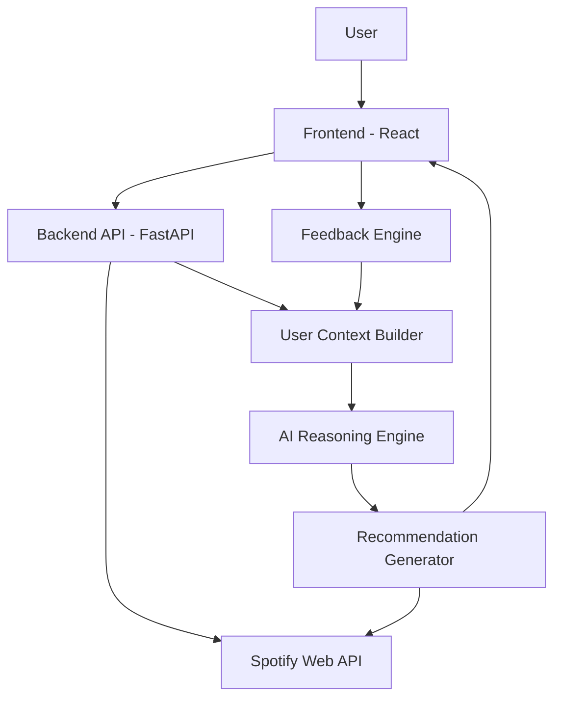
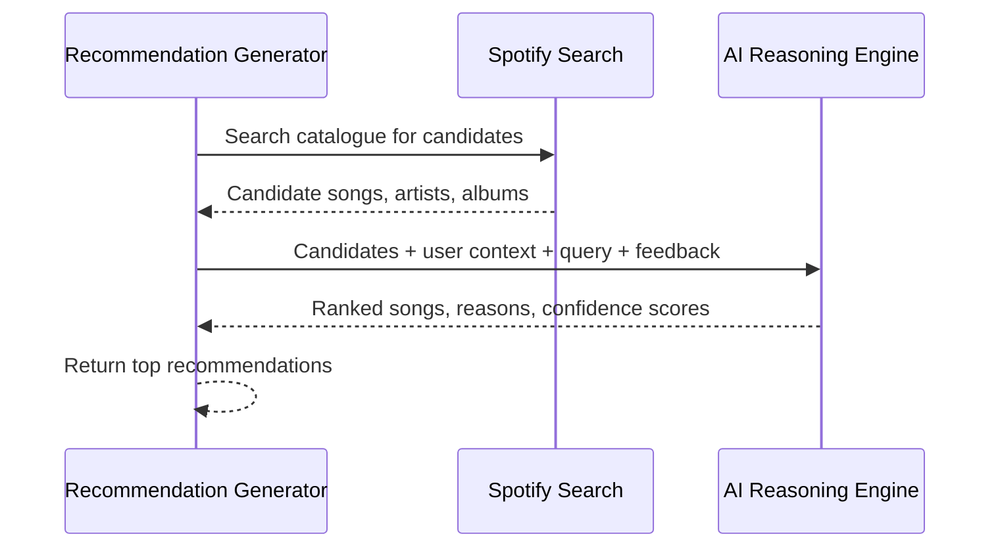

# Architecture — Sense By spotify

## Overview

The system is a full-stack MVP that layers session-aware AI reasoning on top of Spotify's Web API. Users authenticate with Spotify, explore an AI-driven discovery feed, and refine recommendations through passive and explicit feedback.

## Frontend

**Stack:** React, TypeScript, Tailwind CSS, Vite

### Pages

| Page | Purpose |
|------|---------|
| Login | Spotify OAuth entry point |
| Home | Dashboard with recent activity and entry to discovery |
| Discover | Natural-language prompt and discovery controls |
| Recommendation Feed | Ranked AI recommendations |
| Now Playing | Current playback context |
| Recommendation Details | Deep dive on a single recommendation |

### Key Components

- Spotify Login Button
- Search Bar
- AI Prompt Input
- Recommendation Cards (song, artist, album, confidence, explanation)
- Why Recommended button
- Like button with feedback popup
- Recently Played, Top Artists, Top Tracks widgets

## Backend API

**Stack:** Python, FastAPI

| Method | Endpoint | Description |
|--------|----------|-------------|
| `POST` | `/login` | Initiate or complete Spotify OAuth |
| `GET` | `/user/profile` | Authenticated user profile |
| `GET` | `/user/top-artists` | User's top artists |
| `GET` | `/user/top-tracks` | User's top tracks |
| `GET` | `/user/recently-played` | Recently played tracks |
| `GET` | `/search` | Search tracks and artists |
| `POST` | `/generate-recommendations` | Run discovery pipeline and return ranked results |
| `POST` | `/feedback` | Record passive or explicit session feedback |

## External Services

### Spotify Web API

Primary data source for listening behavior and catalogue search.

**Docs:** [Spotify Web API](https://developer.spotify.com/documentation/web-api)

**Endpoints used:**

- OAuth authentication
- User profile
- Recently played tracks
- Top artists and top tracks
- Track, artist, and album search
- Album metadata

**Search reference:** [Search API](https://developer.spotify.com/documentation/web-api/reference/search)

### AI Provider

**Primary:** OpenAI GPT-5.5  
**Alternatives:** GPT-4.1, Gemini, Groq

## Core Pipeline

### 1. User Context Builder

Aggregates signals into a single **Current User Context** object:

| Source | Signals |
|--------|---------|
| Spotify | Recently played, top artists, top genres, liked songs (if available) |
| Session | First search, current search query |
| Feedback | User feedback chips and interaction events |

### 2. Recommendation Generator

**Ranking factors:**

- Session intent
- Long-term taste
- Exploration profile
- Novelty tolerance

### 3. AI Reasoning Engine

**Inputs:**

- User context
- Listening history
- Search query
- Session feedback
- Candidate songs from Spotify

**Outputs (per recommendation):**

- Ranked song list
- Human-readable recommendation reason
- Confidence score

**Example explanation:**

> Recommended because you're currently listening to relaxing acoustic music and usually enjoy emotional indie artists.

### 4. Feedback Engine

Feedback updates user context and triggers re-ranking in subsequent requests.

**Passive signals**

| Signal | Meaning |
|--------|---------|
| Skip | Low relevance for current intent |
| Replay | Strong positive signal |
| Search | Explicit intent shift |
| Song completion | Engagement with the recommendation |

**Explicit signals (post-like popup)**

Prompt: *"What did you like?"*

Options: Mood · Lyrics · Vocals · Beat · Instrumental · Similar Artist · Surprise Me

## Data & Auth

| Concern | Choice |
|---------|--------|
| Authentication | Spotify OAuth |
| Persistent storage | PostgreSQL |
| Music & profile data | Spotify Web API (no local catalogue mirror in MVP) |

## Deployment

| Layer | Platform |
|-------|----------|
| Frontend | Vercel |
| Backend | Railway |

## End-to-End Request Flow

1. User opens Sense By spotify and signs in with Spotify.
2. Frontend loads profile, top artists/tracks, and recently played.
3. User submits a search query or AI prompt.
4. Backend builds user context from Spotify data and session state.
5. Recommendation Generator fetches candidate tracks from Spotify Search.
6. AI Reasoning Engine ranks candidates and generates explanations.
7. Frontend renders recommendation cards with confidence and "why recommended" copy.
8. User interactions (skip, like, feedback chips) are sent to `/feedback`.
9. Updated context informs the next recommendation request.
