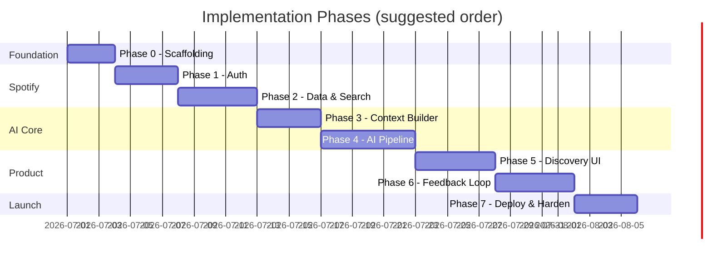

# Phase-Wise Implementation Plan

This plan breaks [Sense By spotify](./architecture.md) into incremental phases. Each phase delivers a testable slice of the system and maps directly to the goals in the [problem statement](./problemStatement.md).

## Guiding Principles

- **Ship vertically** — Each phase ends with something a user can run end-to-end, not just isolated layers.
- **Defer complexity** — Session state can start in memory; persist to PostgreSQL when feedback and multi-session behavior matter.
- **Prove the core loop early** — Context → candidates → AI rank → explain → feedback → re-rank is the product; optimize polish after it works.

## Phase Overview

| Phase | Focus | Outcome |
|-------|--------|---------|
| 0 | Foundation & tooling | Runnable frontend + backend skeleton |
| 1 | Spotify auth & identity | User can log in and stay authenticated |
| 2 | Listening data & search | Home dashboard and catalogue search work |
| 3 | User context builder | Unified context object from Spotify + session |
| 4 | AI recommendation pipeline | Ranked, explained recommendations from a prompt |
| 5 | Discovery UI | Full recommendation feed and detail views |
| 6 | Feedback loop | Session adapts from passive and explicit signals |
| 7 | Persistence & deployment | Production-ready MVP on Vercel + Railway |

---

## Phase 0 — Foundation & Tooling

**Goal:** Establish project structure, shared contracts, and local dev workflow.

### Tasks

**Backend**
- [ ] Initialize FastAPI project (`app/`, routers, config, CORS)
- [ ] Add environment config (`.env.example`): Spotify client ID/secret, redirect URI, OpenAI key, database URL
- [ ] Define shared Pydantic models: `UserProfile`, `Track`, `Artist`, `Recommendation`, `UserContext`
- [ ] Add health check endpoint (`GET /health`)
- [ ] Set up logging and basic error response format

**Frontend**
- [ ] Initialize Vite + React + TypeScript + Tailwind
- [ ] Add routing shell (React Router): Login, Home, Discover, Feed, Details, Now Playing (stubs)
- [ ] Configure API client (base URL, auth header injection)
- [ ] Add shared TypeScript types mirroring backend models

**DevOps**
- [ ] Register Spotify Developer application (redirect URIs for local + production)
- [ ] Document local run instructions in `README.md`

### Exit Criteria

- `npm run dev` and `uvicorn` both start without errors
- Frontend can call backend health check
- Type contracts are aligned between frontend and backend

### Dependencies

None.

---

## Phase 1 — Spotify Authentication

**Goal:** Users sign in with Spotify OAuth and the backend can call Spotify on their behalf.

**Maps to:** Architecture → Authentication; End-to-end flow steps 1–2 (partial).

### Tasks

**Backend**
- [ ] Implement `POST /login` — initiate OAuth and handle callback/token exchange
- [ ] Store access + refresh tokens (in-memory or session cookie for MVP start)
- [ ] Add token refresh middleware before Spotify API calls
- [ ] Implement auth dependency for protected routes
- [ ] Implement `GET /user/profile`

**Frontend**
- [ ] Build Login page with Spotify Login Button
- [ ] Handle OAuth redirect and persist session token
- [ ] Add auth guard: redirect unauthenticated users to Login
- [ ] Show basic profile on Home after login

**Spotify scopes (minimum)**
- `user-read-private`
- `user-read-email`
- `user-top-read`
- `user-read-recently-played`
- `user-library-read` (if liked songs are used)

### Exit Criteria

- User completes Spotify login locally
- `GET /user/profile` returns authenticated user data
- Expired tokens refresh without forcing re-login

### Dependencies

Phase 0.

---

## Phase 2 — Listening Data & Search

**Goal:** Surface Spotify listening signals and enable catalogue search — the raw inputs for context and candidates.

**Maps to:** Problem statement → long-term taste + session intent (search); Architecture → Spotify Web API.

### Tasks

**Backend**
- [ ] Create Spotify API client module (rate limiting, error mapping)
- [ ] Implement `GET /user/top-artists`
- [ ] Implement `GET /user/top-tracks`
- [ ] Implement `GET /user/recently-played`
- [ ] Implement `GET /search` (tracks, artists; optional album metadata)
- [ ] Normalize Spotify responses into internal `Track` / `Artist` models

**Frontend**
- [ ] Build Home dashboard widgets: Recently Played, Top Artists, Top Tracks
- [ ] Build Search Bar component (debounced search → `/search`)
- [ ] Add loading, empty, and error states for all data fetches
- [ ] Link from Home to Discover entry point

### Exit Criteria

- Authenticated user sees real Spotify data on Home
- Search returns tracks and artists from Spotify catalogue
- API errors (401, 429) are handled gracefully in the UI

### Dependencies

Phase 1.

---

## Phase 3 — User Context Builder

**Goal:** Aggregate Spotify signals, session state, and (placeholder) feedback into a single `UserContext` object the AI pipeline can consume.

**Maps to:** Problem statement → four signals (intent, taste, exploration, novelty); Architecture → User Context Builder.

### Tasks

**Backend**
- [ ] Define `UserContext` schema:
  - `recently_played`, `top_artists`, `top_genres` (derived from artists)
  - `liked_songs` (if scope available)
  - `current_query`, `first_search` (session)
  - `feedback_events[]` (session, initially empty)
  - `exploration_profile`, `novelty_tolerance` (inferred defaults or heuristics)
- [ ] Implement `UserContextBuilder` service:
  - Fetch Spotify data in parallel
  - Derive genres from top artists
  - Merge session fields from request or server-side session store
- [ ] Add session store (in-memory dict keyed by user ID for MVP)
- [ ] Unit tests for context assembly and genre derivation

**Frontend**
- [ ] Pass current search query and session ID with API requests
- [ ] (Optional) Debug panel showing assembled context in dev mode

### Exit Criteria

- Given a logged-in user + search query, backend produces a consistent `UserContext` JSON
- Context includes all four problem-statement signal categories (even if exploration/novelty start as defaults)
- Session survives across multiple API calls within the same browser session

### Dependencies

Phase 2.

---

## Phase 4 — AI Recommendation Pipeline

**Goal:** Generate ranked discovery recommendations with explanations and confidence scores.

**Maps to:** Core product loop; Problem statement → objectives 1–3; Architecture → Recommendation Generator + AI Reasoning Engine.

### Tasks

**Backend**
- [ ] Implement candidate retrieval:
  - Build search queries from user context + AI prompt (genre, artist, mood keywords)
  - Call Spotify Search; dedupe; cap candidate pool (e.g. 30–50 tracks)
- [ ] Implement AI Reasoning Engine:
  - System prompt defining ranking criteria (session intent, taste, exploration, novelty)
  - Structured output schema: `[{ track_id, rank, reason, confidence }]`
  - Provider abstraction (OpenAI GPT-5.5 primary; swap-friendly interface)
- [ ] Implement `POST /generate-recommendations`:
  - Input: `query` (natural language), optional `limit`
  - Flow: build context → fetch candidates → AI rank → enrich with Spotify metadata → respond
- [ ] Add fallback when AI fails (return search results with generic reason)
- [ ] Log prompts and responses for iteration (redact tokens in production)

**Prompt engineering (iterative)**
- [ ] Few-shot examples for explanation tone (concise, user-facing)
- [ ] Instructions to balance familiarity vs discovery based on `novelty_tolerance`
- [ ] Validate JSON output; retry on malformed responses

**Testing**
- [ ] Integration test with mocked Spotify + mocked LLM
- [ ] Manual eval checklist: relevance, explanation quality, diversity

### Exit Criteria

- `POST /generate-recommendations` returns 5–10 ranked tracks with `reason` and `confidence` per item
- Explanations reference session intent and taste (not generic boilerplate)
- Pipeline completes within acceptable latency (< 10s for MVP)

### Dependencies

Phase 3.

---

## Phase 5 — Discovery UI

**Goal:** Complete the user-facing discovery experience — prompt input, feed, cards, and detail view.

**Maps to:** Problem statement → success criteria 1–3; Architecture → Frontend pages and components.

### Tasks

**Frontend**
- [ ] **Discover page**
  - AI Prompt Input (natural language)
  - Submit → call `/generate-recommendations`
  - Loading skeleton while pipeline runs
- [ ] **Recommendation Feed**
  - Recommendation Cards: song, artist, album art, confidence badge
  - "Why Recommended" expandable section or modal
  - Navigate to Recommendation Details
- [ ] **Recommendation Details page**
  - Full explanation, metadata, link to Spotify
  - Like button (wired in Phase 6)
- [ ] **Now Playing** (lightweight)
  - Show current track from session or last played recommendation
  - Context for passive feedback events later
- [ ] Responsive layout with Tailwind; consistent card design

**Backend**
- [ ] Ensure recommendation response includes all fields needed by UI (album art URL, external Spotify URI)
- [ ] Add pagination or `limit` param if feed grows

### Exit Criteria

- User can describe intent in natural language and see a ranked feed
- Each card shows explanation and confidence
- User can open detail view for any recommendation
- Empty and error states are handled

### Dependencies

Phase 4.

---

## Phase 6 — Feedback Loop

**Goal:** Capture passive and explicit feedback and use it to improve recommendations within the session.

**Maps to:** Problem statement → session adaptation + success criterion 4; Architecture → Feedback Engine.

### Tasks

**Backend**
- [ ] Implement `POST /feedback`:
  - Payload: `track_id`, `event_type` (skip | replay | search | complete | like), optional `chips[]`
  - Append to session `feedback_events`
  - Update heuristics: lower novelty after skips, boost similar signals after likes
- [ ] Extend `UserContextBuilder` to incorporate feedback history
- [ ] Re-rank on subsequent `/generate-recommendations` calls using updated context
- [ ] Define explicit feedback chips: Mood, Lyrics, Vocals, Beat, Instrumental, Similar Artist, Surprise Me

**Frontend**
- [ ] Emit passive events: skip, replay, search change, song completion (from Now Playing or card actions)
- [ ] **Like button** → post-like popup: "What did you like?" with chip multi-select
- [ ] Show subtle "Recommendations updated" when re-fetching after feedback
- [ ] Debounce rapid feedback to avoid API spam

**Testing**
- [ ] Verify context changes after feedback (e.g. skip reduces confidence for similar tracks)
- [ ] Session feedback persists until logout or session expiry

### Exit Criteria

- Liking a track triggers explicit feedback popup; chips are stored
- Skip/like events change the next batch of recommendations measurably
- User can complete the full loop: prompt → feed → interact → refreshed feed

### Dependencies

Phase 5.

---

## Phase 7 — Persistence, Hardening & Deployment

**Goal:** Move from local MVP to a deployable, maintainable product.

**Maps to:** Architecture → PostgreSQL, Vercel, Railway.

### Tasks

**Database (PostgreSQL)**
- [ ] Schema: `users`, `sessions`, `feedback_events`, optional `recommendation_logs`
- [ ] Migrate session store from in-memory to DB
- [ ] Store refresh tokens securely (encrypted or hashed; never log plaintext)

**Backend hardening**
- [ ] Rate limiting on `/generate-recommendations` (cost control)
- [ ] Request validation, timeout on AI calls
- [ ] CORS locked to production frontend origin
- [ ] Environment-based config for Railway

**Frontend hardening**
- [ ] Environment variables for API URL (Vercel)
- [ ] Production OAuth redirect URI registered in Spotify app
- [ ] Basic accessibility pass (focus states, labels on interactive elements)

**Deployment**
- [ ] Deploy backend to Railway (PostgreSQL addon)
- [ ] Deploy frontend to Vercel
- [ ] Smoke test full flow in production: login → discover → feedback → re-rank

**Documentation**
- [ ] Update README with setup, env vars, and architecture links
- [ ] Document known limitations and post-MVP ideas

### Exit Criteria

- Production URL serves the full MVP flow
- Sessions and feedback survive server restarts
- Secrets are not committed; `.env.example` is complete
- All [success criteria](./problemStatement.md#success-criteria) are demonstrable in production

### Dependencies

Phase 6.

---

## Cross-Phase Checklist (Problem Statement Alignment)

Use this to verify the MVP meets the stated goals before calling the project done.

| Goal | Phase(s) | Verification |
|------|----------|--------------|
| Natural language or behavior-driven intent | 4, 5 | User submits prompt; context uses recent plays + search |
| Ranked, moment-relevant recommendations | 4, 5 | Feed shows ranked list with confidence |
| Transparent per-track explanations | 4, 5 | "Why Recommended" shows AI reason |
| Session improves with interaction | 6 | Second generate call differs after like/skip |
| Discover unfamiliar music | 4 | Candidates include non-top-artist tracks |
| Reduce manual searching | 5 | Discovery flow replaces browse-only search |

---

## Suggested Post-MVP Enhancements

Not required for initial launch; track after Phase 7.

- **Playback integration** — Spotify Web Playback SDK for in-app listen + accurate completion events
- **Exploration/novelty inference** — ML or rule-based profile from historical skips/likes
- **Caching** — Cache top artists/tracks; cache AI responses for identical context hashes
- **A/B prompt versions** — Compare explanation styles and ranking prompts
- **Analytics** — Track skip rate, like rate, and explanation expand rate per session

---

## Risk Register

| Risk | Mitigation |
|------|------------|
| Spotify API rate limits | Batch fetches; cache profile data; backoff on 429 |
| AI latency / cost | Cap candidates; stream UI loading; rate limit generate endpoint |
| Weak explanations | Iterate prompts; add eval set; fallback templates |
| OAuth redirect mismatch | Register all URIs early; test prod login in Phase 7 |
| Session state loss | Move to PostgreSQL in Phase 7 before public demo |

---

## Document Links

- [Problem Statement](./problemStatement.md)
- [Architecture](./architecture.md)
