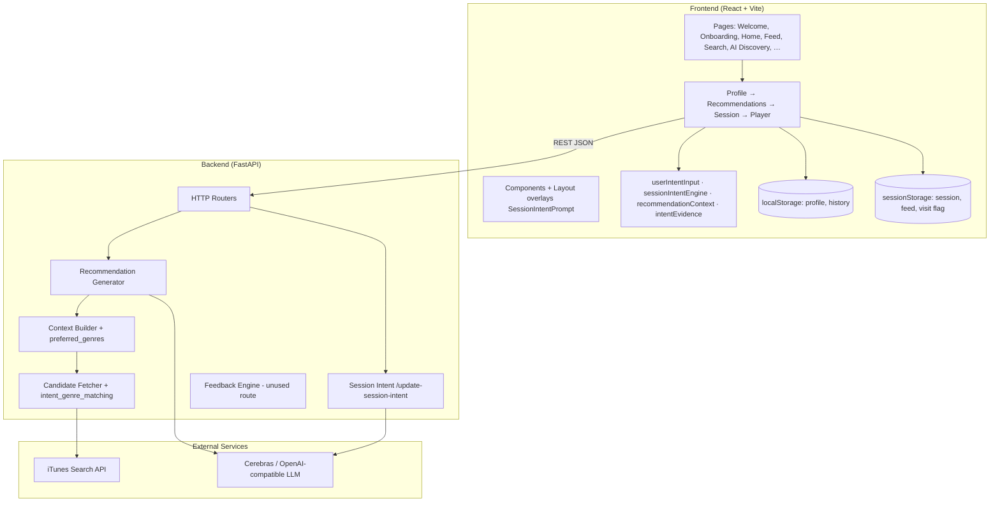
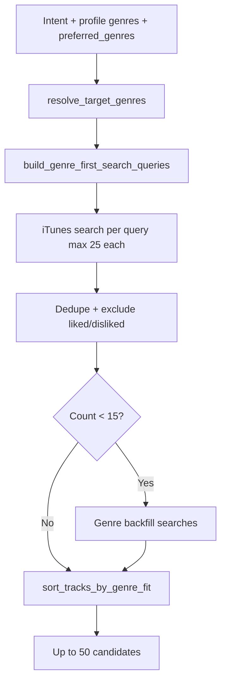
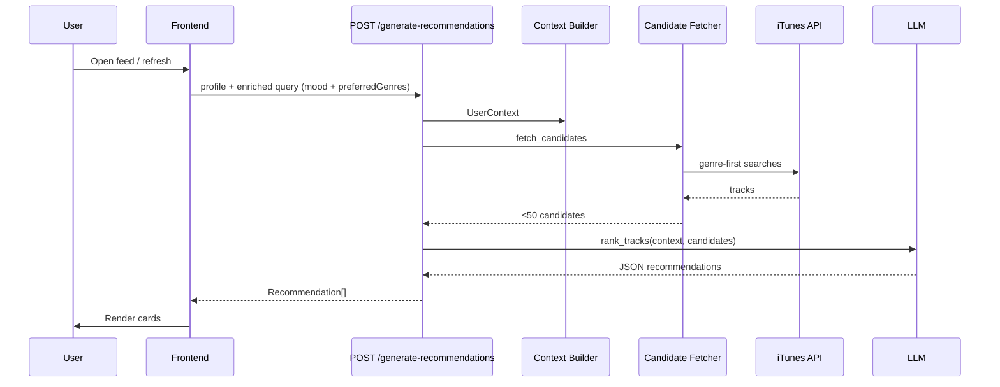
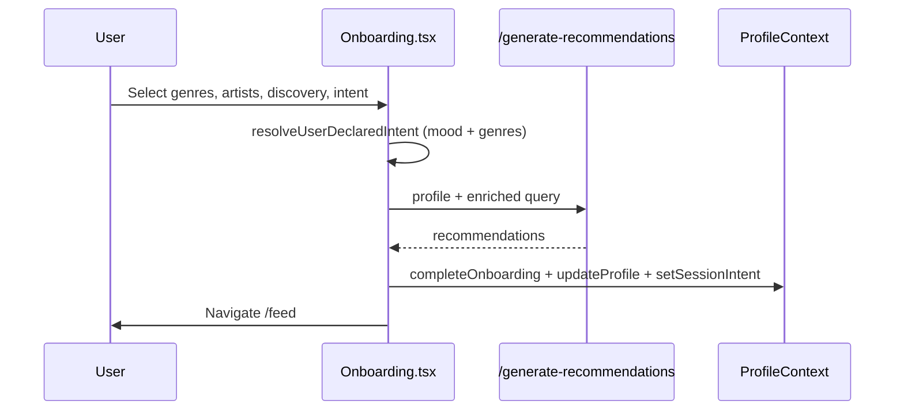
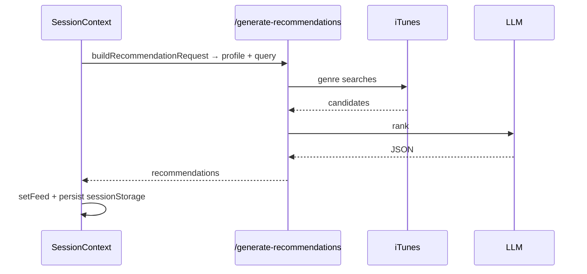
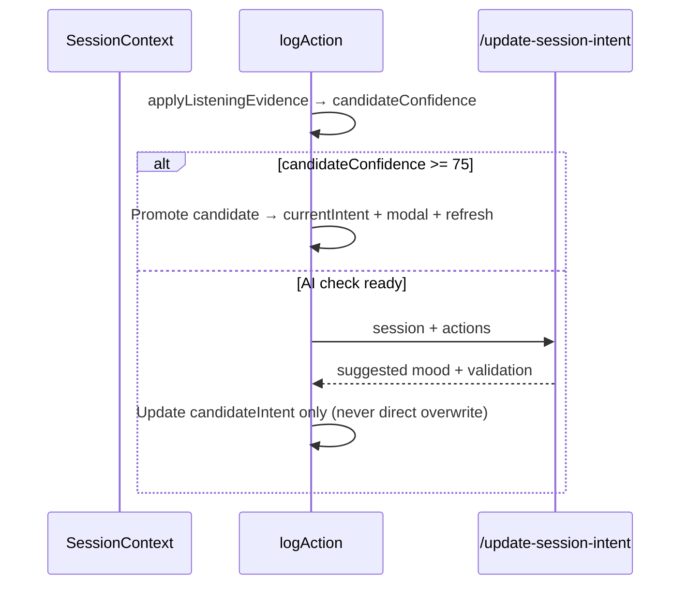
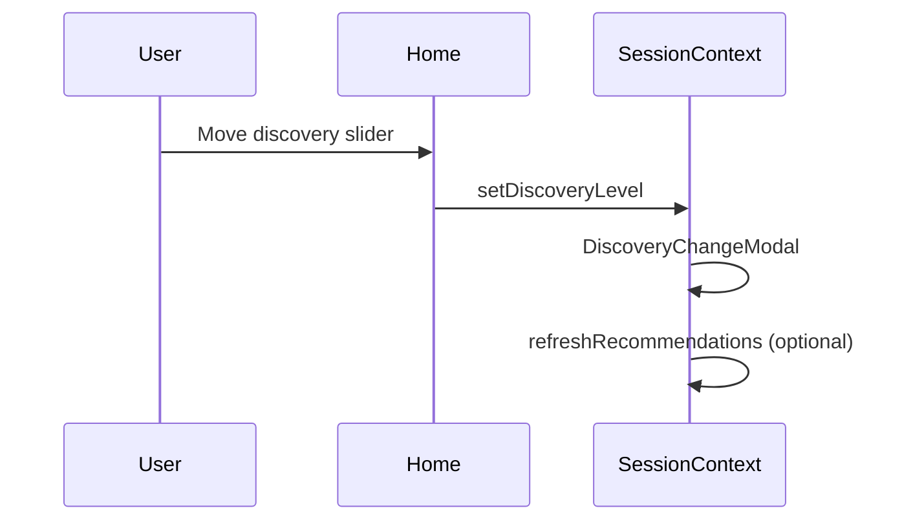
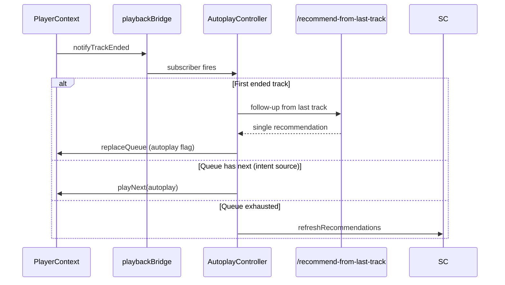
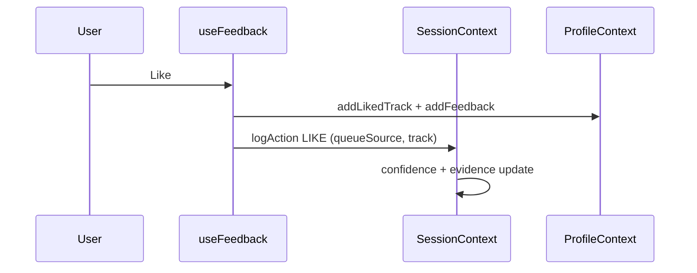

# Sense by Spotify — Project Bible

> **Document purpose:** Enable a new engineering team to understand the entire product without reading source code.  
> **Based on:** Current implementation (session-intent refactor, March 2026). Last committed baseline: `096a445`.  
> **Status:** MVP / demo-ready prototype with behaviour-first session intent.

---

## Section 1 — Project Overview

### Product Name
**Sense** (branded **Sense by Spotify** in UI copy)

### Product Description
Sense is an AI-powered music discovery web application that recommends songs based on **what the user wants right now** (session intent), not only what they liked in the past. It combines iTunes catalog search, genre-aware candidate retrieval, and LLM ranking to produce explainable recommendations with preview playback.

### Problem Statement
Traditional streaming recommendations optimize for **long-term taste** (history, likes, collaborative filtering). Users often experience:

- Repetitive suggestions that mirror past listening
- Manual searching to match the current moment
- Low trust in opaque recommendations

The gap is **session-aware reasoning**: knowing *why* someone is listening today, how open they are to novelty, and when mood has shifted.

### Target Users
- Music listeners who want contextual discovery (study, workout, romantic evening, etc.)
- Users frustrated with static recommendation feeds
- Product/demo audiences evaluating AI-assisted discovery UX

### Core Value Proposition
**Discover the right unfamiliar music for this moment**, with transparent explanations, adapting within a single listening session.

### Unique Selling Point
A **confidence-gated Session Intent system** that:
- Separates *committed session mood* (`currentIntent`) from *predicted mood shift* (`candidateIntent` + `candidateConfidence`)
- Learns mood from **listening behaviour only** — search never overwrites session intent
- Requires evidence (plays, 20s listens, likes, AI evaluation) before switching intent at **75 candidate points**
- Parses free-text intent into canonical moods + genre hints (e.g. “hindi urdu poetry” → `Melancholic · Hindi, Urdu`)
- Defers autoplay confidence until 20 seconds of real listening

### Why Traditional Recommendation Systems Fail Here
| Limitation | Impact |
|------------|--------|
| History-only signals | Cannot detect mood shifts mid-session |
| No intent object | Cannot explain *why* recommendations changed |
| Opaque ranking | Users don't trust suggestions |
| Search vs feed conflation | Manual search incorrectly treated as permanent preference |
| No exploration control | Users cannot balance familiar vs new |

### Why AI Is Uniquely Suited
| Capability | Use in Sense |
|------------|--------------|
| Natural language understanding | Maps "chill study beats" → Focus/Study intent |
| Multi-signal fusion | Combines profile, intent, genres, feedback, candidates |
| Explainability | Generates per-track human-readable reasons |
| Contextual ranking | Re-ranks 50 iTunes candidates better than rule-only sort |
| Session intent inference | Interprets behavioural action sequences |

AI is **not** used for music retrieval (iTunes API) or playback (browser audio). It is used for **ranking** and **session intent detection**.

---

## Section 2 — Product Flow

### Complete User Journey

```mermaid
flowchart TD
    A[Splash 1.2s] --> B{onboardingCompleted?}
    B -->|No| W[/welcome]
    W --> GS[Get Started - mark onboarded]
    GS --> H[/home Layout]
    B -->|Yes| H
    H --> C{intentDeclaredThisSession?}
    C -->|No - first load, new tab, 2h idle| M[Blocking SessionIntentPrompt modal]
    M --> M1[Chips or free text]
    M1 --> M2[Parse mood + genres]
    M2 --> M3[Generate recommendations]
    M3 --> F[/feed]
    C -->|Yes - same tab refresh| APP[Browse app - restore session]
    F --> APP
    APP --> L[Play previews - log actions]
    L --> D{candidateConfidence >= 75?}
    D -->|Yes| SW[Intent switch modal + feed refresh]
    D -->|No| CL[Continue current mood]
    SW --> LOOP[Autoplay, feedback, discovery slider]
    CL --> LOOP
    LOOP --> R{New tab or idle > 2h?}
    R -->|Yes| NS[New session - clear feed]
    NS --> C
    R -->|No| L
```

### Step-by-Step

| Step | What happens |
|------|----------------|
| **1. Splash** | 1.2s overlay on any route. |
| **2. Profile gate** | If `onboardingCompleted` is false → **`/welcome`**. If true → **`/` redirects to `/home`**. |
| **3. Welcome (once)** | **Get Started** sets `onboardingCompleted: true` in localStorage and navigates to **`/home`**. No other inputs. |
| **4. Intent gate (blocking)** | On Layout pages, if `!intentDeclaredThisSession` → **full-screen `SessionIntentPrompt`** overlays `/home`. User **cannot browse** Home/Feed/Search until they submit. Triggers: first visit after welcome, **new browser tab**, or **2h idle**. |
| **5. Declare intent** | Mood chips or free text → parse canonical mood + genres → `POST /generate-recommendations` → **`/feed`**. |
| **6. Same-tab refresh** | Restores session + feed from **sessionStorage** → **no modal** if intent already declared. |
| **7. Main app** | Nav: Home, Feed, Search, AI Discovery, Now Playing. Player bar + global search always available. |
| **8. Listening loop** | Previews log PLAY / LISTENED_20S / LIKE / SKIP. Search seeds **candidate** (+12) only — never overwrites committed mood. |
| **9. Mood shift (behaviour)** | When `candidateConfidence >= 75` from listening → **IntentChangeModal** → feed refresh. Separate from initial declare-intent. |
| **10. Session reset** | New tab or 2h idle → fresh session, feed cleared → back to step 4 (modal on `/home`). |
| **11. Re-declare (optional)** | **AI Discovery** page runs the same `establishSessionIntent` flow anytime → `/feed`. |

---

## Section 3 — Feature Inventory

| Feature | Purpose | Business Value | User Value | Status | Key Files |
|---------|---------|----------------|------------|--------|-----------|
| Onboarding wizard | Capture taste + intent | Personalization bootstrap | Fast setup | **Removed** | Replaced by `SessionIntentPrompt` only |
| AI Discovery page | NL intent → feed | Intent-led discovery | Describe mood in words | **Working** | `AIDiscovery.tsx`, `SessionContext.tsx` |
| Recommendation feed | Ranked cards + previews | Core product surface | Browse AI picks | **Working** | `RecommendationFeed.tsx`, `RecommendationCard.tsx` |
| Session Intent Card | Show current/predicted mood | Trust + transparency | See what AI thinks | **Working** | `SessionIntentCard.tsx`, `intentPredictionDisplay.ts` |
| Session Intent Prompt | **Only onboarding input** — mood + free text | Session bootstrap | One screen to start | **Working** | `SessionIntentPrompt.tsx`, `SessionContext.tsx` |
| User intent parsing | Free text → mood + genres | Cleaner UX + better recs | “hindi urdu poetry” → Melancholic · Hindi, Urdu | **Working** | `userIntentInput.ts`, `intentValidation.ts` |
| Confidence meter | Visual 0–75 candidate threshold | Educates gating logic | Know when mood will switch | **Working** | `IntentConfidenceMeter.tsx` |
| Intent change modal | Confirm mood shift | Reduces surprise | Clear before/after | **Working** | `IntentChangeModal.tsx` |
| Discovery level slider | Familiar vs new balance | Exploration control | Tune novelty | **Working** | `DiscoveryLevelCard.tsx`, `discoveryLevel.ts` |
| Discovery change modal | Confirm exploration shift | UX for adaptation | See discovery updates | **Working** | `DiscoveryChangeModal.tsx` |
| iTunes search | Find any track/artist | Catalogue access | Play anything | **Working** | `Search.tsx`, `routers/search.py` |
| Search candidate seed | Search may seed `candidateIntent` at 12 pts | Explore without overwriting session | Side-quest mood hypothesis | **Working** | `sessionIntentEngine.ts`, `SessionContext.tsx` |
| Preview playback | 30s iTunes previews | Engagement | Listen in-app | **Working** | `PlayerContext.tsx` |
| Queue + autoplay | Continuous listening | Session stickiness | Hands-free flow | **Working** | `AutoplayController.tsx`, `PlayerContext.tsx` |
| Follow-up recommendation | 2nd song personalized | Continuity | Smart autoplay first chain | **Working** | `recommend_from_track.py`, `followUpRecommendationService.ts` |
| Like / dislike / skip | Feedback signals | Learning loop | Correct bad picks | **Working** | `useFeedback.ts`, `PlayerFeedbackButtons.tsx` |
| Feedback chips | Explicit preference tags | Richer signals | Say *why* you liked | **Working** | `FeedbackPopup.tsx` |
| 20s listen boost | Sustained engagement signal | Reduces noise from skips | Reward real listening | **Working** | `intentEvidence.ts`, `PlayerContext.tsx` |
| Autoplay defer confidence | No instant mood shift on autoplay | Prevents queue skew | Fair intent detection | **Working** | `PlayerContext.tsx`, `SessionContext.tsx` |
| Local promotion at 75 | Switch without AI-only gate | Reliable UX | Mood actually changes | **Working** | `SessionContext.tsx` |
| AI session intent check | Backend mood inference | Safety net + merge | AI validates behaviour | **Working** | `session.py`, `openai_provider.py` |
| Genre-first candidates | Better iTunes retrieval | Quality candidates | Relevant genres | **Working** | `candidates.py`, `intent_genre_matching.py` |
| Cultural genre routing | Hindi/Urdu/poetry → Indian Pop targets | Relevant regional recs | Poetry mood gets Bollywood not Classical | **Working** | `intent_genre_matching.py`, `recommendationContext.ts` |
| Fallback ranking | No-AI degraded path | Resilience | Still get results | **Working** | `recommendation_generator.py` |
| Session debugger | Dev/demo introspection | Demo + QA | Inspect state | **Working** (demo mode) | `SessionDebugger.tsx` |
| Demo mode toggle | Show debug tools | Presentations | Power users | **Working** | `DemoModeToggle.tsx` |
| Spotify OAuth | Real user identity | Production auth | Login with Spotify | **Missing** | `.env` vars only |
| PostgreSQL persistence | Server-side state | Scale + multi-device | Sync across devices | **Partial** | `db/models.py` not wired to routes |
| POST /feedback API | Server feedback ingest | Centralized learning | N/A | **Missing** | Schema exists, no route |
| Full Spotify catalogue | Native streaming | Production parity | Play full songs | **Missing** | iTunes previews only |
| Recommendation history sync | Cross-session memory | Long-term taste | Resume anywhere | **Partial** | localStorage only |

---

## Section 4 — System Architecture

### High-Level Architecture



### Frontend Architecture
- **Pattern:** React SPA with context-based state management (no Redux)
- **Provider order:** `ProfileProvider` → `RecommendationsProvider` → `SessionProvider` → `PlayerProvider`
- **Routing:** React Router v6 — `/welcome`, `/onboarding` (pre-auth); `/home`, `/feed`, `/search`, `/discovery`, etc. behind `OnboardingGate`
- **Layout overlays:** `SessionIntentPrompt`, nav, player bar (authenticated routes only)
- **Global overlays (main.tsx):** modals, autoplay, debugger, splash
- **Styling:** Tailwind CSS
- **API:** `api/client.ts` + `sessionIntentService.ts` + `followUpRecommendationService.ts`

### Backend Architecture
- **Pattern:** Stateless REST API; all user/session state sent per request from client
- **Music:** iTunes Search API only (Deezer removed)
- **AI:** OpenAI-compatible client (`OpenAIProvider`) with JSON mode
- **Rate limiting:** In-memory sliding window on generate endpoints

### AI Architecture
Two LLM call sites:
1. **Track ranking** — candidates + context → ranked list + reasons
2. **Session intent detection** — actions + profile → intent change proposal

Frontend performs additional **rule-based confidence** logic independent of backend.

### Data Architecture
| Layer | Storage | Contents |
|-------|---------|----------|
| Browser | `localStorage` | Profile, recommendation history, autoplay, demo mode, recent plays |
| Browser | `sessionStorage` | **Session state**, intent history, feed snapshot (`sense_feed`), visit flag |
| Backend | None (active routes) | Stateless per request |
| Backend | PostgreSQL (scaffold) | Models exist, not connected |

### State Management
See Section 13.

### Session Management
- Session ID generated client-side (`generateSessionId`)
- Persisted in **`sessionStorage`** (`SESSION_STORAGE_KEY`) — scoped to browser tab
- **New tab** = new session (`SESSION_VISIT_KEY` gate); **refresh in same tab** keeps session
- 2-hour idle expiry (`SESSION_EXPIRY_MS`) on `lastActive`
- Intent history ring buffer (20 entries)
- Queue synced between `PlayerContext` and `SessionState`

### Recommendation Pipeline
See Section 5.

### Feedback Pipeline
- **Frontend:** `logAction` → evidence counters → optional discovery adaptation → optional AI check
- **Backend:** `feedback_engine.py` exists but **no HTTP endpoint** exposes it

### Music Data Pipeline
```
User query / session intent + preferredGenres
  → resolveUserDeclaredIntent() [frontend: mood + genre hints]
  → buildRecommendationQuery() [frontend: enrich API query]
  → resolve_target_genres(intent, profile.genres, preferred_genres)
  → build_genre_first_search_queries()
  → iTunes search (up to 50 tracks)
  → genre backfill if < 15 candidates
  → exclude liked/disliked IDs
  → AI rank OR fallback_rank by genre score
  → artist diversity (max 2 per artist)
  → Recommendation[]
```

---

## Section 5 — Recommendation Engine

### Inputs

| Input | Source | Used for |
|-------|--------|----------|
| **Current intent** | Session `currentIntent` (canonical mood) | Mood genre mapping, AI prompt |
| **Preferred genres** | Session `preferredGenres` + API `preferred_genres` | Cultural/language targeting (Hindi, Urdu, Ghazal) |
| **Enriched query** | `buildRecommendationQuery(intent, preferredGenres)` | Backend keyword + genre resolution |
| **Favourite genres** | Onboarding `profile.genres` | Genre expansion, taste profile |
| **Favourite artists** | Onboarding + session `preferredArtists` | Context summary, diversity |
| **Discovery level** | Session `discoveryLevel` (0–100) | AI prompt: % familiar vs new |
| **Recent feedback** | `profile.feedbackEvents`, liked/disliked IDs | Exclusions + prompt context |
| **Session behaviour** | Drives `candidateIntent` only | Indirect — does not change rank query until promotion |
| **Candidate songs** | iTunes API | AI ranking pool |

### User Intent Parsing (frontend → backend)

Free-text intent is **never stored or displayed verbatim** in the session UI.

| User input | Parsed mood | `preferredGenres` | Display label |
|------------|-------------|-------------------|---------------|
| `"Workout"` | Workout | — | Workout |
| `"I want hindi urdu poetry"` | Melancholic | Hindi, Urdu | Melancholic · Hindi, Urdu |
| `"chill study beats"` | Focus or Study | — | Focus / Study |

**Files:** `userIntentInput.ts` (`resolveUserDeclaredIntent`), `intentValidation.ts`, `SessionContext.applyUserDeclaredIntent`.

**Backend cultural override:** When `preferred_genres` or query keywords include Hindi/Urdu/Ghazal, `resolve_target_genres` prioritizes **Indian Pop / Bollywood / World** and **suppresses** generic mood defaults (e.g. Reading → Classical/Jazz).

### Candidate Fetching (`backend/app/services/candidates.py`)



### AI Ranking (`OpenAIProvider.rank_tracks`)

**Priority order in prompt:**
1. Genre fit (iTunes `primary_genre`)
2. Current intent / mood
3. Taste profile
4. Discovery level
5. Feedback signals

**Output per track:** `title`, `artist`, `score`, `reason`, `confidence` (High/Medium/Low)

**Post-processing:**
- `_validate_ranked` — drops hallucinated IDs not in candidate list
- `apply_artist_diversity` — max 2 tracks per artist
- Maps to `Recommendation` with `Track` object

### Fallback (`fallback_rank`)
When AI fails: sort candidates by `score_track_genre_fit` against target genres. Still returns recommendations with generic reasons.

### Explanations
Generated by LLM in `reason` field. Frontend parses bullets via `parseReasonBullets`. Shown on recommendation cards and detail page.

### Complete Flowchart



---

## Section 6 — Session Intent Architecture

### What Session Intent Is
The **committed listening mood/activity** for the current browser-tab session (e.g. Workout, Melancholic, Focus). It drives recommendation queries and genre targeting.

**Not session intent:** genre labels alone, artist names, discovery level labels, or raw free-text sentences.

### Two-Layer Intent Model

| Field | Meaning | Who sets it |
|-------|---------|-------------|
| `currentIntent` | Committed session mood | User declaration (onboarding, prompt, AI Discovery) or promotion at 75 pts |
| `intentConfidence` | Confidence in **current** mood (100 when user-declared) | Set to 100 on explicit declaration |
| `candidateIntent` | Predicted mood shift being watched | Listening evidence, search seed, AI suggestion |
| `candidateConfidence` | Points toward switching to candidate (0–100) | Listening evidence only (+ search seed at 12) |

**Critical rule:** Search and AI **never directly overwrite** `currentIntent`. They may update `candidateIntent` / `candidateConfidence` only.

### Initialization

| Path | Initial `currentIntent` | `intentDeclaredThisSession` |
|------|-------------------------|----------------------------|
| New tab / expired session | `null` → prompt required | `false` |
| `SessionIntentPrompt` submit | Parsed canonical mood | `true` |
| Onboarding intent step | Parsed canonical mood | `true` |
| AI Discovery `establishSessionIntent` | Parsed canonical mood | `true` |
| Before user declares (neutral) | `null` or General Listening fallback for recs | `false` |

`needsIntentPrompt = profile.onboardingCompleted && !session.intentDeclaredThisSession`

### How It Changes

| Source | Effect on `currentIntent` | Effect on candidate |
|--------|---------------------------|---------------------|
| **User declaration** | Immediate set + `intentConfidence: 100` | Clears candidate |
| **Listening (feed/autoplay)** | Promotes at ≥ 75 `candidateConfidence` | +/- points via genre fit |
| **Search** | **No change** | May seed `candidateIntent` at 12 pts (`applySearchCandidateSeed`) |
| **AI `/update-session-intent`** | **No direct overwrite** | Suggests candidate; frontend validates |

### Threshold Logic
- **`INTENT_CONFIDENCE_THRESHOLD = 75`** — applies to **`candidateConfidence`**, not `intentConfidence`
- Promotion when `candidateConfidence ≥ 75` AND `candidateIntent ≠ currentIntent`
- **Latch:** after promotion, session does not revert if candidate drops
- **Intent modal timing:** 2800ms visible + 600ms dismiss delay before feed refresh

### Evidence Weights (`actionEvidenceWeight` in `intentEvidence.ts`)

Applied when track **matches** predicted/candidate intent genre fit:

| Action | Weight |
|--------|--------|
| PLAY | +5 |
| LISTENED_20S | +10 |
| PREVIEW_COMPLETED | +15 |
| REPLAY | +20 |
| LIKE | +25 |
| FEEDBACK | +10 |
| SKIP | −15 |
| DISLIKE | −30 |
| SEARCH / SEARCH_* / RECOMMENDATION_CLICKED | 0 |

**Autoplay PLAY:** weight deferred (0) until LISTENED_20S fires.

**On-genre vs off-genre:** `sessionIntentEngine.applyListeningEvidence` uses `trackIntentFit` — off-genre listens reduce candidate confidence; on-genre listens aligned with **current** intent decay candidate by 10 (`CANDIDATE_DECAY_ON_CURRENT_MATCH`).

### Search Candidate Seed (not a separate browse object)
- Removed: standalone `searchCandidate` object and `searchCandidateIntent.ts`
- Search updates `lastSearchQuery` always
- If search text maps to a **valid mood** different from current → seeds `candidateIntent` at **12 points** (cap below switch threshold by design)
- Artist/genre-only searches do not seed a candidate

### User-Declared Intent Parsing

```
Raw text → resolveUserDeclaredIntent()
  → validateProposedIntent / extractIntentFromText / inferIntentFromSearchQuery
  → refineIntentForCulturalListening()  [poetry + hindi/urdu → Melancholic]
  → extractGenreHintsFromText()           [Hindi, Urdu, Ghazal, …]
  → currentIntent + preferredGenres + displayLabel
```

### Validation

**Frontend (`intentValidation.ts`):**
- 21 `VALID_INTENTS` + `General Listening` (neutral, not promotable)
- Rejects genre labels, discovery labels, artist names as session intent

**Backend (`session_intent_validation.py`):**
- Same rules + `sanitize_session_intent_result`

### Allowed Intent List (21)
Focus, Workout, Driving, Relaxing, Study, Party, Travel, Sleep, Romantic, Morning, Late Night, Meditation, Coding, Reading, Rainy Evening, Road Trip, Festival, High Energy, Calm, Happy, Melancholic

### AI Evaluation Triggers (`shouldEvaluateIntent`)
- 3 meaningful interactions, OR
- 2 explicit preference signals (like/replay/feedback), OR
- 60 seconds since first PLAY/LISTENED_20S in window

### Known Implementation Quirks
| Quirk | Impact |
|-------|--------|
| Dual confidence fields | `intentConfidence` (current mood) vs `candidateConfidence` (switch progress) |
| `profile.currentIntent` vs `session.currentIntent` | Can diverge; session is authoritative for feed |
| iTunes missing genre → neutral fit | `trackMatchesPredictedIntent` may not penalize |
| Cultural moods override Reading genres | Hindi/Urdu poetry uses Indian Pop, not Classical |

### Future Improvements
- Persist declared raw query for analytics (optional)
- Unified confidence model
- Server-persisted session for multi-device
- Intent history analytics dashboard

---

## Section 7 — Discovery Level Architecture

### What It Is
A **0–100 slider** representing willingness to hear **unfamiliar** music vs **familiar** favourites. Stored as `session.discoveryLevel` and `profile.noveltyTolerance`.

### Purpose
Controls exploration/exploitation balance in AI ranking prompt.

### Labels (`getDiscoveryProfile`)

| Range | Label |
|-------|-------|
| 0–25 | Mostly Familiar |
| 26–50 | Balanced Explorer |
| 51–75 | Adventurous Explorer |
| 76–100 | Discovery Enthusiast |

### How AI Uses It
Injected into ranking prompt via `discoveryLevelToPrompt()`:
> "Prioritise approximately X% familiar music and Y% new discoveries."

### User Controls
- Onboarding discovery style step (presets 20, 50, 80)
- `DiscoveryLevelCard` slider on Home (manual adjust)

### How It Changes
| Trigger | Behaviour |
|---------|-----------|
| Manual slider | `setDiscoveryLevel` → optional feed regenerate |
| `computeDiscoveryAdjustment` | LIKE → +5 toward discovery; SKIP/DISLIKE on favourite artist → −8 |

Shows `DiscoveryChangeModal` on significant shift.

### How Recommendations Change
Higher discovery → AI prompt weights unfamiliar artists more. Not a hard filter — soft ranking bias.

### Discovery Level vs Genres vs Artists vs Intent

| Concept | What it is | Example | Changes recommendations by |
|---------|------------|---------|---------------------------|
| **Intent** | Mood/activity now | Romantic | Genre targets, query |
| **Genres** | Long-term taste | Bollywood, Indie | Candidate pool + ranking |
| **Artists** | Favourite creators | Arijit Singh | Preference boost, diversity |
| **Discovery Level** | Novelty appetite | 80 = adventurous | Familiar vs new weighting |

**Critical:** Discovery Level must **never** become Session Intent (validated on both frontend and backend).

---

## Section 8 — Data Model

### LocalUserProfile (`types/index.ts` + `ProfileContext`)

| Property | Type | Description |
|----------|------|-------------|
| `genres` | `string[]` | Onboarding genre selections |
| `favouriteArtists` | `FavouriteArtist[]` | `{ id, name, image_url }` |
| `noveltyTolerance` | `number` | 0–100, mirrors discovery level |
| `currentIntent` | `string` | Profile-level canonical mood (may lag session) |
| `onboardingCompleted` | `boolean` | Gate for routes |
| `feedbackEvents` | `FeedbackEvent[]` | Historical feedback log |
| `likedTrackIds` | `string[]` | iTunes track IDs |
| `dislikedTrackIds` | `string[]` | Excluded from candidates |

### SessionState (`types/index.ts`)

| Property | Type | Description |
|----------|------|-------------|
| `sessionId` | `string` | UUID-like client ID |
| `createdAt` | `string` | ISO timestamp |
| `lastActive` | `string` | ISO timestamp for expiry + tab continuity |
| `currentIntent` | `string \| null` | Committed session mood (null until declared) |
| `candidateIntent` | `string \| null` | Predicted / watching mood |
| `intentConfidence` | `number` | Confidence in **current** mood (100 when user-declared) |
| `candidateConfidence` | `number` | 0–100 points toward switching to candidate |
| `evidence` | `IntentEvidenceEntry[]` | Action log with confidence deltas |
| `confidenceTimeline` | `ConfidenceTimelineEntry[]` | Candidate confidence history |
| `intentDeclaredThisSession` | `boolean` | User submitted intent this tab visit |
| `lastSearchQuery` | `string \| null` | Last committed search (display only) |
| `preferredArtists` | `string[]` | Session-learned artists |
| `preferredGenres` | `string[]` | Session-learned / parsed genres (Hindi, Urdu, …) |
| `discoveryLevel` | `number` | 0–100 |
| `discoveryLabel` | `string` | Human label |
| `confidence` | `number` | Legacy AI confidence 0–1 |
| `interactionsCollected` | `number` | Meaningful action count |
| `explicitPreferenceSignals` | `number` | Likes/replays/feedback count |
| `recentActions` | `SessionAction[]` | Ring buffer (~15) |
| `currentQueue` | `Track[]` | Player queue snapshot |
| `currentQueueIndex` | `number` | Queue position |
| `lastUpdated` | `string` | ISO timestamp |
| `recommendationVersion` | `number` | Bumped on intent/discovery change |
| `aiReason` | `string` | Last explanation (concise, not raw user text) |
| `intentDecision` | `string` | Human-readable decision line |
| `lastPromotionReason` | `string \| null` | Last promotion explanation |
| `rejectedAiIntents` | `string[]` | Invalid AI suggestions ignored |
| `lastIntentValidation` | `IntentValidationDebug \| null` | Last backend validation |
| `personalizedSecondSongUsed` | `boolean` | One-time follow-up flag |

**Removed / deprecated (migrated on load):** `searchCandidate`, `searchCandidates[]`, `listeningShiftIntent`, `listeningShiftPlayCount`.

### SearchCandidate (deprecated)

Legacy parallel browse object — **no longer written**. Kept in types for old persisted sessions only.

| Property | Type | Description |
|----------|------|-------------|
| `intent` | `string` | Browsed mood |
| `confidence` | `number` | Was capped at 74 |
| `query` | `string` | Originating search |
| `lastActiveAt` | `string` | ISO timestamp |

### Recommendation

| Property | Type | Description |
|----------|------|-------------|
| `track` | `Track` | Full track object |
| `rank` | `number` | 1-based position |
| `reason` | `string` | AI explanation |
| `confidence` | `number` | 0.0–1.0 display score |

### Track

| Property | Type | Description |
|----------|------|-------------|
| `id` | `string` | iTunes track ID |
| `name` | `string` | Title |
| `artists` | `Artist[]` | With genres |
| `album` | `Album \| null` | Artwork, date |
| `primary_genre` | `string \| null` | iTunes primaryGenreName |
| `duration_ms` | `number \| null` | |
| `preview_url` | `string \| null` | 30s preview |
| `external_url` | `string \| null` | iTunes link |
| `popularity` | `number \| null` | |

### SessionAction

| Property | Type | Description |
|----------|------|-------------|
| `type` | `SessionActionType` | SEARCH, PLAY, LISTENED_20S, LIKE, SKIP, etc. |
| `value` | `string` | Track label or query |
| `timestamp` | `number` | Unix ms |

### FeedbackEvent

| Property | Type | Description |
|----------|------|-------------|
| `track_id` | `string \| null` | |
| `event_type` | `FeedbackEventType` | like, unlike, dislike, skip, replay |
| `chips` | `FeedbackChip[]` | mood, lyrics, vocals, etc. |
| `query` | `string \| null` | Active intent at time |
| `timestamp` | `string \| null` | ISO |

### UserContext (backend, built per request)

Aggregated from profile payload: genres, **`preferred_genres`**, artists, novelty tolerance, feedback summary, liked/disliked IDs, `target_genres` for query.

### UserProfilePayload (API)

| Field | Type | Notes |
|-------|------|-------|
| `genres` | `string[]` | Onboarding genres |
| `favourite_artists` | `FavouriteArtist[]` | |
| `novelty_tolerance` | `string \| int \| float` | Discovery level |
| `current_intent` | `string` | Canonical mood |
| **`preferred_genres`** | `string[]` | Session parsed genres sent per generate request |
| `feedback_events` | `FeedbackEvent[]` | |
| `liked_track_ids` / `disliked_track_ids` | `string[]` | Candidate exclusions |
| `onboarding_completed` | `bool` | |

---

## Section 9 — Frontend Structure

### Pages (`frontend/src/pages/`)

| Page | Route | Role |
|------|-------|------|
| `Welcome.tsx` | `/welcome` | Landing |
| `Onboarding.tsx` | `/onboarding` | 4-step setup |
| `Home.tsx` | `/home` | Dashboard |
| `Search.tsx` | `/search` | iTunes search |
| `AIDiscovery.tsx` | `/discovery` | NL intent entry |
| `RecommendationFeed.tsx` | `/feed` | Full feed |
| `RecommendationDetails.tsx` | `/recommendations/:id` | Track detail |
| `NowPlaying.tsx` | `/now-playing` | Expanded player |

### Contexts (provider order)
`ProfileProvider` → `RecommendationsProvider` → `SessionProvider` → `PlayerProvider`

### Hooks
- `useSession` — session API
- `useFeedback` — like/dislike/skip + logAction
- `useSkipRecommendation` — feed skip flow

### Services
- `api/client.ts` — HTTP
- `sessionIntentService.ts` — `/update-session-intent`
- `followUpRecommendationService.ts` — `/recommend-from-last-track`

### Key Utilities
| File | Role |
|------|------|
| `intentEvidence.ts` | Evidence weights, thresholds, evaluation triggers |
| `intentValidation.ts` | Valid intents, mood keyword mapping |
| `userIntentInput.ts` | Parse free text → mood + genre hints + display label |
| `recommendationContext.ts` | Build API query + profile with `preferredGenres` |
| `sessionIntentEngine.ts` | Listening evidence, promotion, search seed |
| `trackIntentFit.ts` | Genre ↔ intent matching |
| `sessionLifecycle.ts` | Expiry, tab visit, bootstrap, recommendation intent |
| `discoveryLevel.ts` | Labels, clamping |
| `discoveryAdaptation.ts` | Auto discovery adjustments |
| `intentPredictionDisplay.ts` | Session card view model |
| `playbackBridge.ts` | Autoplay event bus |

### Routing (`App.tsx`)
Guards: `OnboardingGate`, `RedirectIfOnboarded`. Layout wraps authenticated pages with nav + player bar.

### Global Overlays (in `Layout.tsx` + `main.tsx`)
`SessionIntentPrompt`, `AutoplayController`, `IntentChangeModal`, `DiscoveryChangeModal`, `LearningNotification`, `IntentToast`, `SessionDebugger`

---

## Section 10 — Backend Structure

### API Endpoints

#### `GET /health`
- **Response:** `{ status, environment, timestamp }`

#### `GET /search?q=&limit=`
- **Response:** `SearchResponse { query, tracks, artists }` (artists always `[]` on this endpoint)

#### `GET /search/artists?q=&limit=`
- **Response:** `ArtistSearchResponse { query, artists }`

#### `POST /generate-recommendations`
- **Request:** `{ profile: UserProfilePayload, query, limit }` — `profile.preferred_genres` optional but recommended
- **Response:** `{ query, recommendations[], candidate_count, used_ai }`
- **Rate limit:** 10/min per genre fingerprint

#### `POST /recommend-from-last-track`
- **Request:** `{ profile, last_track: { id, name, artist }, query }`
- **Response:** `{ query, recommendation, candidate_count, used_ai }`

#### `POST /update-session-intent`
- **Request:** `{ profile, session: SessionStatePayload, current_recommendations[] }`
- **Response:** `UpdateSessionIntentResponse` with validation fields

### Key Backend Files

| Path | Role |
|------|------|
| `app/main.py` | FastAPI app, CORS, routers |
| `routers/recommendations.py` | Generate + follow-up |
| `routers/session.py` | Intent update |
| `routers/search.py` | iTunes search proxy |
| `services/recommendation_generator.py` | Main pipeline |
| `services/candidates.py` | iTunes candidate fetch |
| `services/intent_genre_matching.py` | Genre mapping |
| `services/session_intent_rules.py` | Rule-based intent |
| `services/session_intent_validation.py` | Sanitization |
| `services/ai/openai_provider.py` | LLM client |
| `services/ai/prompts.py` | Ranking prompts |
| `services/ai/session_intent_prompts.py` | Intent prompts |

### Environment Variables (active)

| Variable | Default | Purpose |
|----------|---------|---------|
| `CEREBRAS_API_KEY` / `OPENAI_API_KEY` | — | LLM auth |
| `LLM_BASE_URL` | `https://api.cerebras.ai/v1` | API endpoint |
| `LLM_MODEL` | `gpt-oss-120b` | Model |
| `CORS_ORIGINS` | `http://127.0.0.1:5173` | CORS |
| `GENERATE_RATE_LIMIT_PER_MINUTE` | `10` | Rate limit |

---

## Section 11 — AI Prompts

### 1. Track Ranking System Prompt
**File:** `backend/app/services/ai/prompts.py` — `SYSTEM_PROMPT`

| Aspect | Detail |
|--------|--------|
| **Purpose** | Rank iTunes candidates for user intent |
| **Input** | Intent, target genres, profile summary, candidates with genre |
| **Output** | JSON `{ recommendations: [{ title, artist, score, reason, confidence }] }` |
| **Limitations** | Title-only matching explicitly discouraged; depends on iTunes genre quality |
| **Improvements** | Inject recent session actions; multi-turn refinement |

### 2. Track Ranking Few-Shot
**File:** `prompts.py` — `FEW_SHOT_USER` / `FEW_SHOT_ASSISTANT`  
Example: late night coding → Electronic / Indian Pop ranking.

### 3. Track Ranking User Prompt Builder
**File:** `prompts.py` — `build_user_prompt()`  
Dynamic: query, context_summary, candidates, limit.

### 4. Session Intent System Prompt
**File:** `backend/app/services/ai/session_intent_prompts.py` — `SESSION_INTENT_SYSTEM`

| Aspect | Detail |
|--------|--------|
| **Purpose** | Detect if listening intent changed |
| **Input** | Current intent, allowed list, recent actions, profile, recommendations |
| **Output** | JSON `{ intentChanged, newIntent, preferredGenres, preferredArtists, confidence, reason }` |
| **Limitations** | Stateless; no audio features; 15-action window only |
| **Improvements** | Stream actions; audio mood classification |

### 5. Session Intent User Prompt
**File:** `session_intent_prompts.py` — `build_session_intent_user_prompt()`

### Frontend AI (implicit)
No direct LLM calls in frontend. All "AI" UX is driven by backend responses + local confidence simulation.

---

## Section 12 — Application Flow (Sequence Diagrams)

### Onboarding



### Recommendation Generation



### Session Intent Update



### Discovery Level Update



### Autoplay



### Feedback (Like)



---

## Section 13 — State Flow

### localStorage

| Key | Constant | When it changes |
|-----|----------|-----------------|
| `sense_profile` | `PROFILE_STORAGE_KEY` | Onboarding, feedback, likes |
| `sense_recommendation_history` | `HISTORY_STORAGE_KEY` | New recommendations deduped |
| `sense_demo_mode` | `DEMO_MODE_STORAGE_KEY` | Demo toggle |
| `sense_autoplay` | `AUTOPLAY_STORAGE_KEY` | Autoplay toggle |
| `sense_recent_plays` | (PlayerContext) | Each new track play |

### sessionStorage

| Key | Constant | When it changes |
|-----|----------|-----------------|
| `sense_session` | `SESSION_STORAGE_KEY` | Every `persistSession` |
| `sense_session_visit` | `SESSION_VISIT_KEY` | Set on tab load — gates new vs resumed session |
| `sense_feed` | `FEED_STORAGE_KEY` | `setFeed` on recommendation load |

### Session Context (in-memory + persisted)
Updated on: every `logAction`, intent promotion, discovery change, queue sync, AI check completion.

### Profile Context
Updated on: onboarding, explicit profile edits, feedback hooks.

### Backend Memory
- Rate limiter buckets (ephemeral)
- No user state on active API routes

---

## Section 14 — User Interaction Flow

| Action | What happens |
|--------|----------------|
| **Search** | `SEARCH` logged; updates `lastSearchQuery`; may seed `candidateIntent` at 12 pts — **does not change `currentIntent`** |
| **Play (feed)** | `PLAY` + track; `candidateConfidence` via genre fit; deferred if autoplay |
| **Play (search)** | Same listening path — search queue does not bypass session rules |
| **20s listen** | `LISTENED_20S`; +10 on-genre toward candidate or decay if aligned with current |
| **Like** | Profile liked IDs + `LIKE` +25 toward candidate |
| **Skip** | Skip feedback + remove from feed/queue; −15 |
| **Dislike** | −30 toward candidate |
| **Replay** | `REPLAY` +20 |
| **Change discovery** | Slider → modal → optional regenerate |
| **Refresh recommendations** | `buildRecommendationRequest` → POST generate with mood + `preferredGenres` |
| **Declare session intent** | `SessionIntentPrompt` or `establishSessionIntent` → parse mood + genres → feed refresh |
| **Click recommendation** | `RECOMMENDATION_CLICKED` + play with intent queue |
| **Song ends** | `playbackBridge.notifyTrackEnded` → autoplay controller |
| **Autoplay starts** | `playNext({ autoplay: true })` — no confidence until 20s |

---

## Section 15 — Project Limitations

### Technical
- iTunes previews only (30s), not full tracks
- No Spotify Web API integration despite branding
- Stateless backend — no server-side user DB on live routes
- In-memory rate limiting (not distributed)
- PostgreSQL models incomplete / unwired

### Product
- Single browser device (localStorage)
- No user accounts
- No playlist export to Spotify
- Search `/search` does not use AI ranking (plain iTunes)

### AI
- Depends on iTunes `primary_genre` quality
- Hallucination risk mitigated but not eliminated
- No audio feature analysis
- LLM costs + latency on every generate

### Architecture
- Large `SessionContext.tsx` (~1500 lines) — god context
- Duplicate intent validation frontend/backend
- `profile.currentIntent` vs `session.currentIntent` drift possible

### Scalability
- Client sends full profile every request
- No CDN for assets beyond Vite build
- No horizontal session store

### Demo
- Demo mode exposes internal debugger
- Cerebras/OpenAI key required for full experience
- Fallback ranking lower quality

---

## Section 16 — Project Completeness

| Area | % Complete | Notes |
|------|------------|-------|
| **Overall MVP** | **~78%** | Core loop works end-to-end |
| Architecture | 75% | Vision docs describe Spotify/Postgres; MVP differs |
| Session Intent | 92% | Refactored: behaviour-only learning, intent parsing, sessionStorage |
| Recommendation Engine | 88% | Genre-first + preferred_genres + cultural override + AI |
| Discovery Level | 70% | Works; adaptation rules are simple heuristics |
| Continuous Learning | 75% | In-session yes; cross-session limited |
| Feedback Loop | 65% | Frontend complete; backend `/feedback` missing |
| Autoplay | 80% | Follow-up + queue chain; search queue isolated |
| Frontend | 90% | Polished MVP UI |
| Backend | 75% | Core routes; persistence scaffold unused |
| AI | 85% | Two prompt systems, JSON mode, validation |

---

## Section 17 — Project Consistency Check

| Vision (docs/) | Implementation | Gap | Impact |
|----------------|----------------|-----|--------|
| Spotify Web API | iTunes Search API | No real Spotify data | Branding mismatch; demo only |
| Spotify OAuth login | No auth | Anyone can use app | No personalized Spotify history |
| PostgreSQL persistence | localStorage only | No server state | No multi-device |
| `POST /feedback` endpoint | Schema only | Feedback stays client-side | Backend can't learn globally |
| `POST /login` | Not implemented | — | Doc outdated |
| User top artists/tracks from Spotify | Onboarding search only | No import | Weaker taste bootstrap |
| Song completion signal | LISTENED_20S at 20s not full track | Partial engagement proxy | OK for previews |
| Search updates intent | Search seeds candidate only | Behaviour-first design | Correct — search never hijacks session |
| Dual-lane search browse object | Removed `searchCandidate` | Simpler model | Docs updated March 2026 |
| AI always gates intent switch | Local promotion at 75 candidate pts | Frontend leads | Better UX; AI suggests candidate only |
| Deezer catalogue | Removed | iTunes only | Simpler but different catalog |

---

## Section 18 — Product Evaluation (PM Perspective)

| Dimension | Score /10 | Rationale |
|-----------|-----------|-----------|
| **Presentation** | 8 | Clean dark UI, Spotify-adjacent branding, modals, confidence meter |
| **Communication** | 9 | Per-track reasons, intent card, learning toasts, debugger |
| **Creativity** | 9 | Behaviour-first intent, cultural genre routing, 75pt latch, autoplay defer |
| **Data Orientation** | 7 | Rich local telemetry; no analytics pipeline |
| **Architecture** | 7 | Clear separation; god context; stateless API good for MVP |
| **User Experience** | 8 | Smooth onboarding → listen loop; preview limits hurt |
| **AI Usage** | 8 | Focused on ranking + intent, not AI for everything |

**Overall product readiness:** Strong **demo MVP**, not production Spotify integration.

---

## Section 19 — Project Tree

```
Sense by Spotify
├── docs/
│   ├── problemStatement.md
│   ├── architecture.md
│   ├── implementation-plan.md
│   └── project-bible.md          ← this document
├── frontend/                     (React + Vite + TypeScript)
│   ├── src/
│   │   ├── main.tsx              → Providers + global overlays
│   │   ├── App.tsx               → Routes
│   │   ├── pages/                → 8 user-facing screens
│   │   ├── components/           → 30+ UI components (SessionIntentPrompt, SessionIntentCard, …)
│   │   ├── contexts/
│   │   │   ├── ProfileContext    → taste profile
│   │   │   ├── SessionContext    → intent, confidence, AI orchestration
│   │   │   ├── PlayerContext     → audio, queue, autoplay
│   │   │   └── RecommendationsContext → feed state
│   │   ├── hooks/                → useSession, useFeedback, useSkip
│   │   ├── services/             → session intent, follow-up API
│   │   ├── api/client.ts         → HTTP layer
│   │   ├── utils/
│   │   │   ├── intentEvidence.ts           ← evidence weights + thresholds
│   │   │   ├── sessionIntentEngine.ts      ← listening evidence + search seed
│   │   │   ├── userIntentInput.ts          ← free-text → mood + genres
│   │   │   ├── recommendationContext.ts    ← API query builder
│   │   │   ├── trackIntentFit.ts
│   │   │   ├── intentValidation.ts
│   │   │   ├── sessionLifecycle.ts
│   │   │   └── discoveryLevel.ts
│   │   ├── types/index.ts
│   │   └── constants/brand.ts
│   └── package.json
└── backend/                      (FastAPI + Python)
    ├── app/
    │   ├── main.py
    │   ├── config.py
    │   ├── routers/
    │   │   ├── health.py
    │   │   ├── search.py
    │   │   ├── recommendations.py
    │   │   └── session.py
    │   ├── services/
    │   │   ├── recommendation_generator.py  ← pipeline orchestrator
    │   │   ├── candidates.py
    │   │   ├── recommend_from_track.py
    │   │   ├── intent_genre_matching.py
    │   │   ├── session_intent_rules.py
    │   │   ├── session_intent_validation.py
    │   │   ├── music_catalog.py → itunes.py
    │   │   ├── ai/
    │   │   │   ├── openai_provider.py
    │   │   │   ├── prompts.py
    │   │   │   └── session_intent_prompts.py
    │   │   └── feedback_engine.py (unused route)
    │   ├── models/               → Pydantic domain types
    │   ├── schemas/              → API request/response
    │   └── db/models.py          → SQLAlchemy (not wired)
    └── tests/                    → ~30 unit tests
```

---

## Section 20 — Executive Summary (2-Minute VP Read)

**Sense by Spotify** is an AI music discovery prototype that answers one question: *"What should I listen to right now?"* — not *"What did I listen to last month?"*

**The problem:** Streaming recommendations are great at long-term taste but poor at moment-to-moment intent. Users get repetitive feeds, search manually, and don't trust opaque suggestions.

**The solution:** A session-based AI layer that:
1. Captures **session intent** (canonical mood + genre hints) during onboarding, per-tab prompt, or AI Discovery
2. Parses natural language into moods — not raw sentences in the UI
3. Fetches **genre-matched candidates** from iTunes using mood + `preferred_genres` (e.g. Hindi/Urdu → Indian Pop)
4. Uses an **LLM to rank and explain** each recommendation
5. **Learns during the session** from plays, 20-second listens, likes, and skips — search does not overwrite mood
6. Only **switches mood at 75 candidate confidence points** — preventing accidental intent flips

**Architecture:** React frontend (state in localStorage) + stateless FastAPI backend + iTunes catalog + Cerebras/OpenAI LLM. No Spotify login in the current MVP despite product branding.

**Maturity:** ~78% complete as a demo-ready MVP. Core loops work. Missing: Spotify integration, server persistence, production auth, full-track playback.

**Why it matters:** Demonstrates a credible pattern for **explainable, session-aware AI discovery** that could layer onto a streaming platform without replacing its entire recommendation stack.

---

*End of Project Bible*
